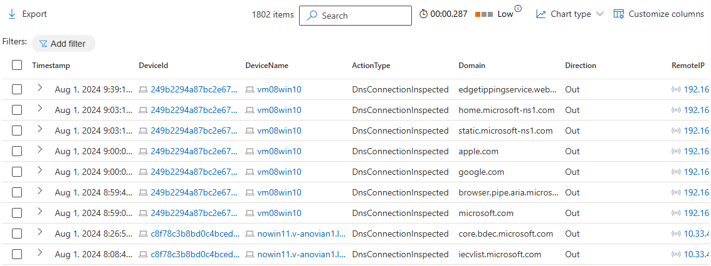

# Collection of Useful Advanced Hunting Query

## Checking DNS Query Record from MDE
```kusto
//Checking DNS Query Record from MDE
DeviceNetworkEvents
| extend Domain=parsejson(AdditionalFields).query
| extend Direction=parsejson(AdditionalFields).direction
| where Domain has_any ("microsoft","google","apple")
| project Timestamp, DeviceId, DeviceName, ActionType, Domain, Direction, RemoteIP,RemotePort , LocalIP, LocalPort, Protocol
| sort by Timestamp desc 
```

